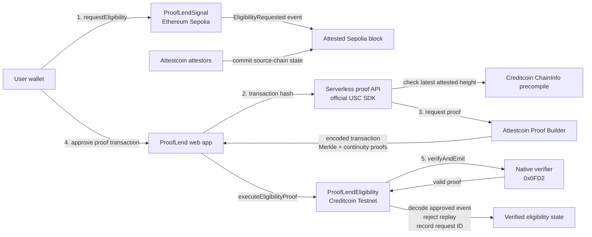

# ProofLend architecture

## Trust boundaries

- The wallet signs both state-changing transactions.
- The proof API gathers public proof material and never receives a private key.
- The Creditcoin contract accepts state changes only after the native verifier accepts the proof.
- The contract checks the Sepolia source contract and event signature before decoding the applicant.
- Each Attestcoin query ID can be processed only once.

